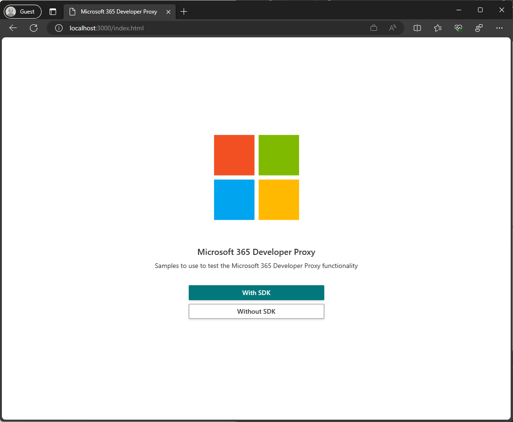

# Samples

## Table of Contents

- [Pre-requisites](#prereqs)
- [Configure Azure AD App Registration](#appreg)
    - [Script](#script)
    - [Manual](#manual)
- [Launch Sample](#launch)

## <a id="prereqs">Pre-requisites</a>

All the samples have been designed with keeping dependencies to an absolute minimum, however there are a few things that you will need.

You will need a Microsoft 365 Tenant and be able to use an account that has permissions to create an Azure AD App Registrations in your tenant.

We highly recommend that you use a Microsoft 365 Developer Tenant with content packs installed when testing these samples, you can create a developer tenant by [signing up to the Microsoft 365 Developer Program](https://aka.ms/m365/).

## <a id="appreg">Configure Azure AD App Registration</a>

There are two ways which you can configur the App Registration required for the samples to work correctly, through automatation using a bash script or manually through Azure Portal.

### <a id="script">Script</a>

```shell
$ > chmod +x /scripts/setup.sh
$ > ./scripts/setup.sh
```

Follow the prompts in the terminal.

> The script uses CLI for Microsoft 365 to authenticate with and create the app registration in your tenant, therefore requires nodejs, v8 or greater to be installed

## <a id="manual">Manual</a>

The following table provides details of how to configure your app registration.

| Property | Value |
| ---- | ---- |
| Name | Microsoft Graph Chaos Proxy Samples |
| Platform type | Single-page application |
| Redirect URIs | http://localhost:5500/withsdk.html <br> http://localhost:5500/nosdk.html |
| API Permissions | Microsoft Graph <br> User.Read.All (Delegate) <br> Presence.Read.All |

After creating the app registation, create a file called `env.js` in the root of the `samples` directory with the following contents, replacing `<clientid>` with the value which can be copied from the portal.

```
const appId = '<clientid>';
```

## <a id="launch">Launch Sample</a>

Follow these instructions to launch the samples using the Visual Studio Code [Live Server](https://marketplace.visualstudio.com/items?itemName=ritwickdey.LiveServer) extension.

> !!! IMPORTANT !!!
> The default host name used by Live Server is `127.0.0.1`, therefore you will need to change the `liveServer.settings.host` setting to `localhost` for the samples to work correctly, as `127.0.0.1` is not a valid Redirect URI.

Open the `samples` directory in Visual Studio Code

```shell
$ > cd samples
$ > code .
```

Start `Live Server`


