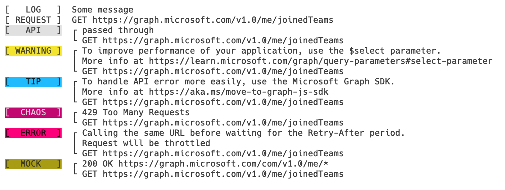
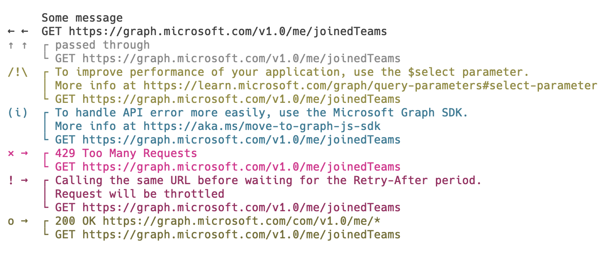
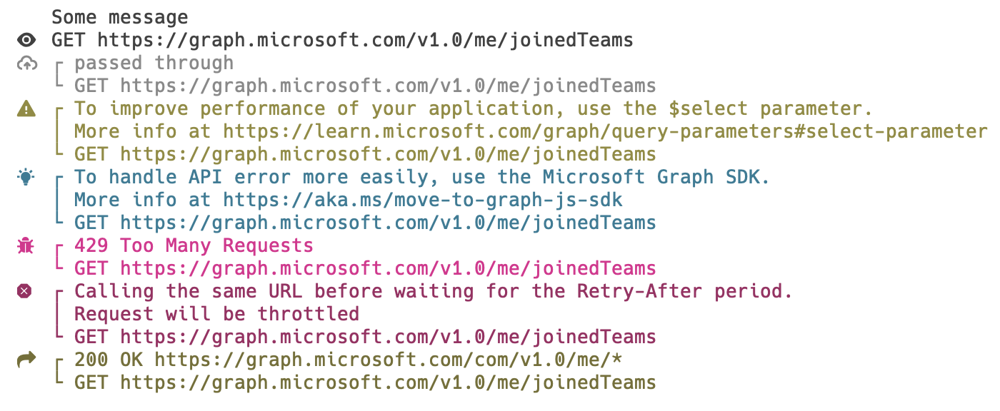

# Improve readability of the console output

To improve readability of the console output, Microsoft Graph Developer Proxy will implement a way to communicate the different types of messages that are output to console.

## History

| Version | Date | Comments | Author |
| ------- | ---- | -------- | ------ |
| 1.0 | 2023-01-13 | Initial specifications | @waldekmastykarz |

## Console output

### Logging levels

The Proxy will support logging the following types of messages:

- **intercepted request**, when the Proxy intercepts/sees a request
- **passed through**, when the Proxy passes a request through to the API
- **warning**, when the Proxy notices a potential issue in the request that may be affecting the application, such as lack of the `$select` query parameter on a GET request
- **tip**, when the Proxy sees room for improvement, such as using a Graph SDK to simplify error handling
- **failed**, when the Proxy forcefully stops the request due to an issue, such as the application not waiting long enough when throttled
- **chaos**, when the Proxy uses its chaos engine, to randomly fail a request
- **mocked**, when the Proxy responds to a request with a mock response

These types of message will be expressed by the following enum:

```cs
enum MessageType
{
  Normal,
  InterceptedRequest,
  PassedThrough,
  Warning,
  Tip,
  Failed,
  Chaos,
  Mocked
}
```

The enum contains a `Normal` value, which is the default value and will be used for all messages that don't fit into any of the other categories.

### Labels

#### Label modes

To improve readability of the console output, each request will be decorated with a label. Proxy will support three types of labels: textual, ASCII icons and [Nerd Font](https://www.nerdfonts.com/) icons. By default, the Proxy will use text labels. The type of labels is configurable in `appsettings.json` by changing the value of the `labelMode` property to either `text`, `icon` or `nerdFont`.

Following is a list of types of messages and the corresponding text- and icon labels (Nerd Font icons are displayed in the [Hack Nerd Font](https://github.com/ryanoasis/nerd-fonts/releases/download/v2.2.2/Hack.zip) font):

Message type|Label|Icon|Nerd Font
------------|-----|----|---------
`Normal`|`[   LOG   ]`|`   `|
`InterceptedRequest`|`[ REQUEST ]`|`← ←`|<span style="font-family: 'Hack Nerd Font'">&#62529;</span>&nbsp;&nbsp;&nbsp;(f441)
`PassedThrough`|`[   API   ]`|`↑ ↑`|<span style="font-family: 'Hack Nerd Font'">&#58172;</span>&nbsp;&nbsp;&nbsp;(e33c)
`Warning`|`[ WARNING ]`|`/!\`|<span style="font-family: 'Hack Nerd Font'">&#62497;</span>&nbsp;&nbsp;&nbsp;(f421)
`Tip`|`[   TIP   ]`|`(i)`|<span style="font-family: 'Hack Nerd Font'">&#64486;</span>&nbsp;&nbsp;&nbsp;(fbe6)
`Failed`|`[  FAIL   ]`|`× →`|<span style="font-family: 'Hack Nerd Font'">&#63067;</span>&nbsp;&nbsp;&nbsp;(f65b)
`Chaos`|`[  CHAOS  ]`|`! →`|<span style="font-family: 'Hack Nerd Font'">&#61832;</span>&nbsp;&nbsp;&nbsp;(f188)
`Mocked`|`[  MOCK   ]`|`o →`|<span style="font-family: 'Hack Nerd Font'">&#61540;</span>&nbsp;&nbsp;&nbsp;(f064)

#### Label colors

When using text labels, only the labels are colored. The log message is printed using the default console color.

Following is the list of colors for each label:

Message type|Background color|Foreground color|Example
------------|----------------|----------------|-------
`Normal`|`Default`|`Default`|[   LOG   ]
`InterceptedRequest`|`Default`|`Default`|[ REQUEST ]
`PassedThrough`|`Gray`|`Black`|<span style="color: black; background: grey">[   API   ]</span>
`Warning`|`Yellow`|`Black`|<span style="color: black; background: yellow">[ WARNING ]</span>
`Tip`|`Blue`|`White`|<span style="color: white; background: blue">[   TIP   ]</span>
`Failed`|`Red`|`White`|<span style="color: white; background: red">[  FAIL   ]</span>
`Chaos`|`DarkRed`|`White`|<span style="color: white; background: darkred">[  CHAOS  ]</span>
`Mocked`|`DarkYellow`|`Black`|<span style="color: black; background: orange">[  MOCK   ]</span>



#### ASCII icons colors

When using ASCII icons, both icons and messages are colored.

Following is the list of colors for each label:

Message type|Foreground color|Example
------------|----------------|-------
`Normal`|`Default`|
`InterceptedRequest`|`Default`|← ←
`PassedThrough`|`Gray`|<span style="color: grey">↑ ↑</span>
`Warning`|`Yellow`|<span style="color: yellow">/!\</span>
`Tip`|`Blue`|<span style="color: blue">(i)</span>
`Failed`|`Red`|<span style="color: red">! →</span>
`Chaos`|`DarkRed`|<span style="color: darkred">× →</span>
`Mocked`|`DarkYellow`|<span style="color: orange">o →</span>



#### Nerd Font icons colors

When using Nerd Font icons, both icons and messages are colored.

Following is the list of colors for each label:

Message type|Foreground color|Example
------------|----------------|-------
`Normal`|`Default`|
`InterceptedRequest`|`Default`|<span style="font-family: 'Hack Nerd Font'">&#62529;</span>&nbsp;&nbsp;&nbsp;(f441)
`PassedThrough`|`Gray`|<span style="font-family: 'Hack Nerd Font'; color: grey">&#58172;</span>&nbsp;&nbsp;&nbsp;(e33c)
`Warning`|`Yellow`|<span style="font-family: 'Hack Nerd Font'; color: yellow">&#62497;</span>&nbsp;&nbsp;&nbsp;(f421)
`Tip`|`Blue`|<span style="font-family: 'Hack Nerd Font'; color: blue">&#64486;</span>&nbsp;&nbsp;&nbsp;(fbe6)
`Failed`|`Red`|<span style="font-family: 'Hack Nerd Font'; color: red">&#63067;</span>&nbsp;&nbsp;&nbsp;(f65b)
`Chaos`|`DarkRed`|<span style="font-family: 'Hack Nerd Font'; color: darkred">&#61832;</span>&nbsp;&nbsp;&nbsp;(f188)
`Mocked`|`DarkYellow`|<span style="font-family: 'Hack Nerd Font'; color: orange">&#61540;</span>&nbsp;&nbsp;&nbsp;(f064)



### Message context

Because messages can be printed out of band (ie. multiple messages about intercepted requests, followed by Proxy's response to each request), it's important to know which message is related to which request. To help with this, each message is suffixed with the request's method and URL.

```text
↑ ↑  ┌ passed through
     └ GET https://graph.microsoft.com/v1.0/me/joinedTeams
```

### Multiline messages

To improve readability, multiline messages will be visually grouped together, using boxes. The first and the last line of the message will be indicated with respectively top-left-, and bottom-left corner symbol. Middle lines of messages of 3 and more lines will be indicated with a | (pipe) symbol.

```text
↑ ↑  ┌ passed through
     └ GET https://graph.microsoft.com/v1.0/me/joinedTeams
```

```text
/!\  ┌ To improve performance of your application, use the $select parameter.
     │ More info at https://learn.microsoft.com/graph/query-parameters#select-parameter
     └ GET https://graph.microsoft.com/v1.0/me/joinedTeams
```

## Logging method

To support requirements listed above, and ensure consistent logging from the Proxy's core and its plugins, we'll implement a centralized method, that accepts an array of messages, the type of the message, and context information about the request:

```cs
interface LoggingContext {
    public SessionEventArgs RequestArgs { get; }
}

Log(string[] messages, MessageType messageType, LoggingContext: context = null): void
```
